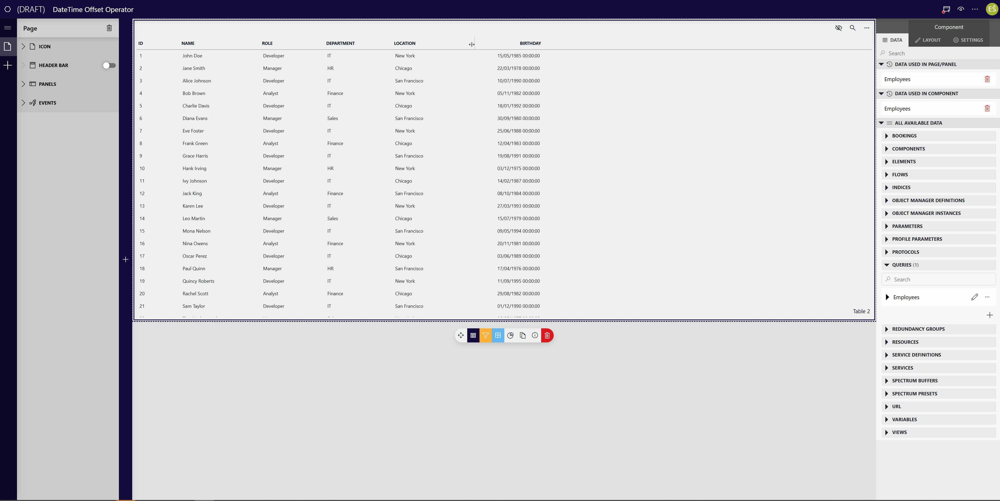

### DateTime Offset Operator

#### Overview

DateTime Offset Operator allows you to offset date column by specifying the amount and units(days, hours, minutes or seconds), afterwards the new value is stored in new column.

#### Using the Operator

1. Click _Apply custom operator_ on your data source
1. Select _DateTime Offset Operator_ for _Operator_
1. Select column you want to offset for _DateTime Value_
1. Enter offset amount for _DateTime Offset Value_
1. Select offset unit for _DateTime Offset Unit_
1. Provide name for the resulting column for _DateTime Result Column Name_

